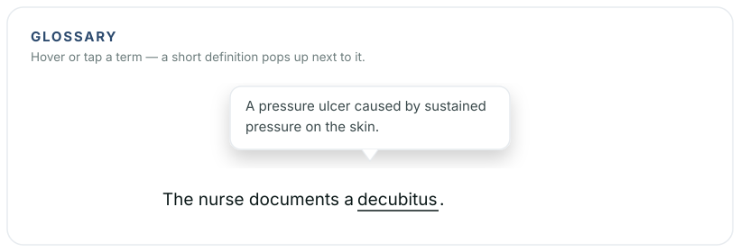

# Reveal - Glossary

[](https://revealjs.com) [](LICENSE)

Inline term definitions for [reveal.js](https://revealjs.com). Mark a technical term on your slide and — on **hover** (desktop) or **tap** (touch / smartboard) — a small explanation pops up right next to it. Great for teaching: explain jargon without breaking your flow, and let students tap the terms themselves when reviewing at home. Standalone (ships its own CSS), colours are easy to theme.

**[Live demo](https://florianloyns.github.io/reveal.js-glossary/demo.html)**

[](https://florianloyns.github.io/reveal.js-glossary/demo.html)

## Installation

Copy the `glossary` folder into your reveal.js `plugin/` folder — or install from npm.

```console
npm install reveal.js-glossary
```

## Setup

**Regular**

```html
<script src="dist/reveal.js"></script>
<script src="plugin/glossary/glossary.js"></script>
<script>
  Reveal.initialize({ plugins: [ RevealGlossary ] });
</script>
```

**As a module**

```html
<script type="module">
  import Reveal from './dist/reveal.esm.js';
  import RevealGlossary from './plugin/glossary/glossary.esm.js';
  Reveal.initialize({ plugins: [ RevealGlossary ] });
</script>
```

## Usage

Mark a term in your slide HTML and put the explanation in `data-def`:

```html
<span class="term" data-def="A pressure ulcer caused by sustained pressure on the skin.">Decubitus</span>
```

The term gets a subtle underline. Hover or tap shows the definition; tapping elsewhere or pressing `Esc` closes it. Simple HTML such as `<strong>` is allowed inside a definition. Definitions live on each slide — there is no central glossary, so every deck controls its own terms, and the explanation stays with the word (handy for students at home).

## Configuration

All options are optional — mainly for theming the colours.

```js
Reveal.initialize({
  glossary: {
    line: 'currentColor',   // underline colour
    tipBg: '#FFFFFF',        // popup background
    tipColor: '#0B1818',     // popup text colour
    tipBorder: '#E7EBEF'     // popup border colour
  },
  plugins: [ RevealGlossary ]
});
```

| Option | Default | Description |
|---|---|---|
| `line` | `'currentColor'` | Underline colour of a term (default matches the text colour) |
| `tipBg` | `'#FFFFFF'` | Popup background |
| `tipColor` | `'#0B1818'` | Popup text colour |
| `tipBorder` | `'#E7EBEF'` | Popup border colour |

Prefer a dark popup? Set `tipBg: '#1E3452'`, `tipColor: '#fff'`, `tipBorder: '#1E3452'`.

## Like it?

Star the repo.

## Imprint

Responsible: Florian Loyns — [imprint & privacy notice](https://florianloyns.com/Impressum/) (German)

## License

MIT — see [LICENSE](LICENSE). Thanks to Hakim El Hattab (reveal.js).
